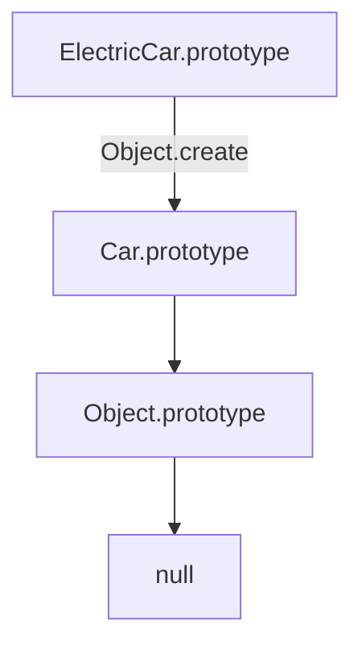

# 🏗️ Constructor Functions & Classical OOP in JS

> [!TIP]
> **The 30-Second Interview Pitch**
> Before ES6 Classes were introduced, JavaScript developers used **Constructor Functions** to create blueprints for objects. A constructor is simply a regular function called with the `new` keyword, which creates a new object, binds `this` to it, and links its `__proto__` to the constructor's `.prototype`. Inheritance is achieved by manually invoking the parent constructor using `.call(this)` and chaining prototypes with `Object.create()`.

---

## 🛠️ 1. What is a Constructor Function?

A constructor function is a regular JavaScript function used to create multiple objects of the same "type". By convention, they are named with a Capital letter. 

What makes it a constructor is the **`new` keyword**.

### Under the Hood: What happens when you use `new`?
When you call a function with `new`, JavaScript does 4 things implicitly:
1. Creates a brand new empty object `{}`.
2. Points `this` to that new object.
3. Links the new object's `__proto__` to the constructor function's `prototype` property.
4. Returns the object automatically (unless you explicitly return another object).

> [!NOTE]
> **Wait, `prototype` vs `__proto__`? What's the difference?**
> This is one of the most confusing parts of JavaScript. 
> 
> | Term | What it is | Who has it |
> |:---|:---|:---|
> | `__proto__` | The **link** pointing to the parent object's prototype. | Every object |
> | `prototype` | A **property** on constructor functions that becomes the `__proto__` of objects created with `new`. | Only functions |
> 
> When `new Car()` is called, JS sets `bmw.__proto__ === Car.prototype`.

```javascript
// ✅ Correct: Using a Constructor Function
function Car(make, speed) {
    // 1. Implicitly: const this = {};
    
    // 2. Assign properties
    this.make = make;
    this.speed = speed;
    
    // 4. Implicitly: return this;
}

const bmw = new Car("BMW", 120);
console.log(bmw.make); // "BMW"
```

> [!WARNING]
> **Gotcha: Forgetting the `new` keyword**
> If you call a constructor function without `new`, `this` will point to the global object (`window` in browsers), polluting the global scope, and the function will return `undefined`.

```javascript
// ❌ Wrong: Forgetting 'new'
const audi = Car("Audi", 100);
console.log(audi); // undefined
console.log(window.make); // "Audi" (Global scope pollution!)
```

---

## 🔗 2. Constructor Linking (Inheritance)

How do we implement inheritance (e.g., an `ElectricCar` inheriting from `Car`) using constructor functions? We need to do two things: **Property Inheritance** and **Method Inheritance**.

### Step 1: Inheriting Properties using `.call()`
Inside the child constructor, we call the parent constructor and explicitly set its `this` context to the child's `this` using `.call()`. This is known as **Constructor Linking**.

```javascript
function ElectricCar(make, speed, battery) {
    // Call the parent constructor, binding 'this' to the ElectricCar instance
    Car.call(this, make, speed);
    this.battery = battery;
}

const tesla = new ElectricCar("Tesla", 150, 90);
console.log(tesla.make); // "Tesla" (Inherited property!)
console.log(tesla.battery); // 90
```

---

## 🧬 3. Method Inheritance & Prototype Chaining

Adding methods directly inside the constructor (e.g., `this.accelerate = function() {}`) is bad practice because it creates a new copy of the function for every instance, wasting memory. 

Instead, we attach methods to the `prototype` object.

```javascript
// Add method to the parent's prototype
Car.prototype.accelerate = function() {
    this.speed += 10;
    console.log(`${this.make} going at ${this.speed} km/h`);
};

// Now, we want ElectricCar to inherit this method!
```

### Step 2: Linking the Prototypes
To inherit methods, we must link the child's prototype to the parent's prototype using `Object.create()`.



```javascript
// ❌ Wrong: ElectricCar.prototype = Car.prototype;
// (This mutates the parent prototype if we add child-specific methods)

// ✅ Correct: Link the prototypes
ElectricCar.prototype = Object.create(Car.prototype);

// Fix the constructor pointer (Object.create wipes it out)
ElectricCar.prototype.constructor = ElectricCar;

// Add child-specific methods AFTER linking
ElectricCar.prototype.charge = function(level) {
    this.battery = level;
    console.log(`${this.make} charged to ${this.battery}%`);
};

// --- Testing the Implementation ---
const rivian = new ElectricCar("Rivian", 100, 50);

rivian.accelerate(); // "Rivian going at 110 km/h" (Inherited from Car)
rivian.charge(80);   // "Rivian charged to 80%" (Own method)
```

> [!NOTE]
> **Why ES6 Classes were introduced?**
> As you can see, manually linking prototypes, calling `Parent.call(this)`, and fixing the `.constructor` pointer is extremely verbose and error-prone. ES6 `class` and `extends` syntax abstracts all this boilerplate away, but under the hood, it still executes this exact Constructor + Prototype linking logic!
