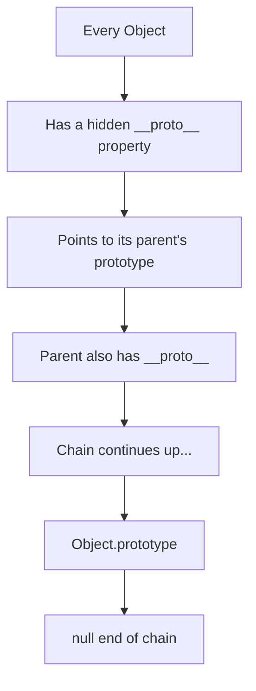
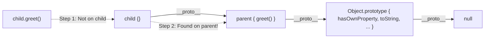

# 🧬 Prototypal Inheritance

JavaScript doesn't use classical inheritance like Java or C++. Instead, it uses **Prototypal Inheritance** — objects can inherit directly from other objects through a hidden link called the **prototype chain**.



---

## 🔗 1. The Prototype Chain

Every object in JavaScript has an internal property called `[[Prototype]]` (accessible via `__proto__`). When you access a property on an object, JavaScript looks for it on the object first. If it doesn't find it, it walks **up the prototype chain**.

```javascript
const parent = {
    greet: function() {
        console.log("Hello from parent!");
    }
};

const child = Object.create(parent); // child's __proto__ = parent

child.greet(); // "Hello from parent!" — Found via prototype chain!
console.log(child.hasOwnProperty("greet")); // false — it's inherited!
```



---

## 🆚 2. `__proto__` vs `.prototype` (The Ultimate Confusion)

This is the most common point of confusion in JS inheritance.

* **`__proto__` (The Umbilical Cord):** Lives on **every object**. It is the live link that connects an object to its parent. When JS looks for a property, it walks up this `__proto__` cord.
* **`.prototype` (The Blueprint Bucket):** Lives **only on Functions** (and ES6 Classes). It is just an object bucket where you store methods. When you create a new object via `new`, the JS engine plugs the new object's `__proto__` cord into the constructor function's `.prototype` bucket.

> [!WARNING]
> **Gotcha: The Developer Console `[[Prototype]]`**
> When you inspect an object in the Chrome Console (like an array `[1,2,3]`), you will see a property named `[[Prototype]]`. This is **NOT** the `.prototype` property! `[[Prototype]]` is simply the browser's graphical label for the hidden `__proto__` umbilical cord.

> **The Golden Rule:** `myObject.__proto__ === ConstructorFunction.prototype`

### Summary Matrix

| Entity | Has `__proto__`? | Has `.prototype`? |
| :--- | :--- | :--- |
| **Normal Object** (`{}`) | **YES** | **NO** |
| **Normal Function** (`function()`) | **YES** | **YES** |
| **ES6 Class** (`class {}`) | **YES** | **YES** |
| **Arrow Function** (`() => {}`) | **YES** | **NO** |

> [!WARNING]
> **Gotcha: Arrow Functions**
> Arrow functions were designed to be lightweight. They do **not** have a `.prototype`, which is exactly why you cannot use the `new` keyword on an arrow function!

---

## 🔨 3. `Object.create()` — Pure Prototypal Inheritance

`Object.create(proto)` creates a new object with its `__proto__` set to the given `proto` object. This is the cleanest way to set up prototype chains!

```javascript
const animal = {
    isAlive: true,
    eat: function() {
        console.log(this.name + " is eating");
    }
};

const dog = Object.create(animal);
dog.name = "Buddy";
dog.bark = function() {
    console.log("Woof!");
};

dog.eat();  // "Buddy is eating" — inherited from animal
dog.bark(); // "Woof!" — own method
console.log(dog.isAlive); // true — inherited from animal
```

---

## 🛡️ 4. Checking the Chain

```javascript
// Check if a property is directly on the object (not inherited)
dog.hasOwnProperty("name"); // true
dog.hasOwnProperty("eat");  // false — it's inherited!

// Check if an object is in another's prototype chain
animal.isPrototypeOf(dog); // true

// Check the constructor
dog instanceof Object; // true — Object is in the chain
```

---

## 🔑 Key Takeaways
1. JavaScript uses **prototypal inheritance** — objects inherit from objects, not classes.
2. `__proto__` is the hidden link every object uses to find inherited properties.
3. The chain ends at `Object.prototype.__proto__` which is `null`.
4. `Object.create()` is the purest way to set up inheritance.

## 🎯 Common Interview Questions

**Q: What is the Prototype Chain?**
- **A:** It is the mechanism by which objects inherit properties from one another. If a property is not found on an object, the JS engine looks at the `__proto__` of the object, and traverses up the chain until it finds the property or reaches `null`.