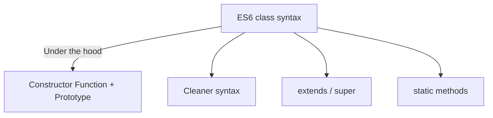
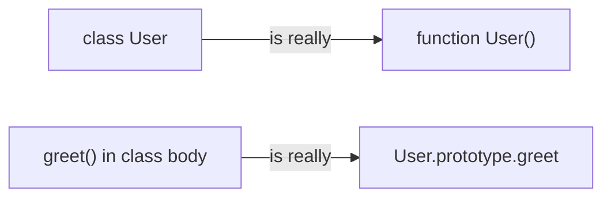
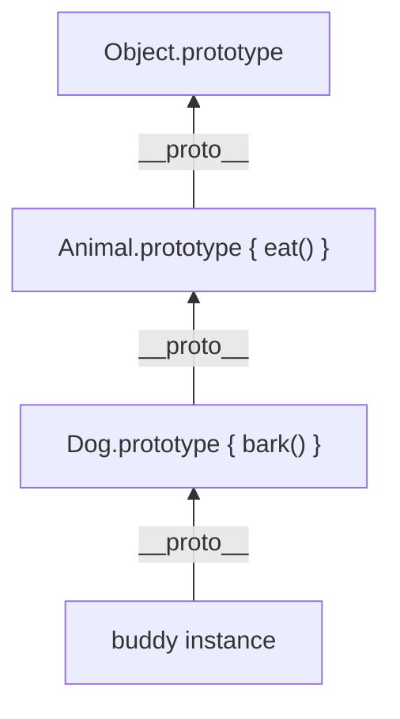

# 🏗️ ES6 Classes & OOP

ES6 Classes are **syntactic sugar** over JavaScript's existing prototypal inheritance. Under the hood, they still use prototypes — but the syntax is much cleaner and familiar to developers coming from languages like Java or Python.



---

## 📦 1. Creating a Class

```javascript
class User {
    // Constructor runs when 'new User()' is called
    constructor(name, age) {
        this.name = name;
        this.age = age;
    }
    
    // Methods are placed on User.prototype automatically
    greet() {
        console.log(`Hi, I'm ${this.name} and I'm ${this.age}`);
    }
}

const raj = new User("Raj", 25);
raj.greet(); // "Hi, I'm Raj and I'm 25"
```

### What happens under the hood?
The class above is equivalent to this old-school code:

```javascript
function User(name, age) {
    this.name = name;
    this.age = age;
}

User.prototype.greet = function() {
    console.log(`Hi, I'm ${this.name} and I'm ${this.age}`);
};
```



---

## 🧬 2. Inheritance with `extends` & `super`

The `extends` keyword sets up the prototype chain automatically. The `super` keyword calls the parent class's constructor.

```javascript
class Animal {
    constructor(name) {
        this.name = name;
        this.isAlive = true;
    }
    
    eat() {
        console.log(this.name + " is eating");
    }
}

class Dog extends Animal {
    constructor(name, breed) {
        super(name); // Calls Animal's constructor
        this.breed = breed;
    }
    
    bark() {
        console.log("Woof!");
    }
}

const buddy = new Dog("Buddy", "Golden Retriever");
buddy.eat();  // "Buddy is eating" — inherited from Animal
buddy.bark(); // "Woof!" — own method
console.log(buddy.isAlive); // true — inherited from Animal
```



> **Rule:** If a child class has a `constructor`, it **must** call `super()` before using `this`. Otherwise, you'll get a `ReferenceError`!

---

## 🔒 3. Static Methods

Static methods belong to the **class itself**, not to instances. You call them directly on the class.

```javascript
class MathHelper {
    static add(a, b) {
        return a + b;
    }
    
    static isEven(n) {
        return n % 2 === 0;
    }
}

// Call on the class — NOT on instances
MathHelper.add(2, 3); // 5
MathHelper.isEven(4); // true

// This DOES NOT work:
const helper = new MathHelper();
helper.add(2, 3); // TypeError: helper.add is not a function
```

---

## 🔐 4. Getters & Setters

Getters and setters let you define methods that behave like properties:

```javascript
class Temperature {
    constructor(celsius) {
        this._celsius = celsius;
    }
    
    get fahrenheit() {
        return this._celsius * 9/5 + 32;
    }
    
    set fahrenheit(f) {
        this._celsius = (f - 32) * 5/9;
    }
}

const temp = new Temperature(100);
console.log(temp.fahrenheit); // 212 — accessed like a property!
temp.fahrenheit = 32;         // set like a property!
console.log(temp._celsius);   // 0
```

---

## 🆚 5. Class vs Constructor Function

| Feature | Class (ES6) | Constructor Function |
|:---|:---|:---|
| Syntax | `class User {}` | `function User() {}` |
| Methods | Defined in class body | Added to `.prototype` manually |
| Hoisting | ❌ NOT hoisted (TDZ applies) | ✅ Function declarations are hoisted |
| `new` required | ✅ Throws error without `new` | ⚠️ Silently fails without `new` |
| `extends` | ✅ Built-in | ❌ Manual prototype chain setup |
| Under the hood | Prototype-based | Prototype-based |

> **Interview Tip:** Classes are NOT a new type of inheritance. They are just a cleaner way to write the same prototype-based code. Always be ready to explain what happens under the hood!


## 🎯 Common Interview Questions

**Q: Are ES6 Classes just syntactic sugar over Prototypal Inheritance?**
- **A:** Yes. Under the hood, JS still uses prototypal inheritance. The `class` keyword just provides a much cleaner, more familiar object-oriented syntax for creating constructor functions and setting up prototype chains.