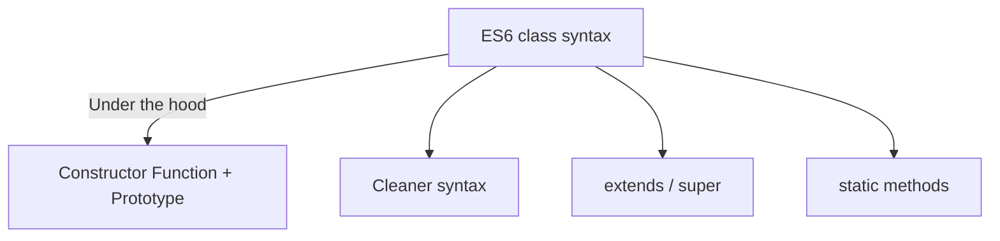

# 🏗️ ES6 Classes & OOP Paradigms

> [!TIP]
> **The 30-Second Interview Pitch**
> ES6 Classes in JavaScript are primarily "syntactic sugar" over the language's existing Prototypal Inheritance model. While providing cleaner syntax for Constructors, Inheritance (`extends`), and Encapsulation (`#` private fields), under the hood, JS remains prototype-based. Key OOP paradigms like Polymorphism (via method overriding) and Abstraction can also be implemented using this syntax.



---

## 📦 1. Creating a Class (Encapsulation)

Classes are blueprints used to create objects and define their structure and behavior.

```javascript
class User {
    // 1. Private fields (Encapsulation)
    #salary;

    // 2. Constructor runs when 'new User()' is called
    constructor(name, age, salary) {
        this.name = name; // Public
        this.age = age;   // Public
        this.#salary = salary; // Private
    }
    
    // 3. Methods are placed on User.prototype automatically
    greet() {
        console.log(`Hi, I'm ${this.name} and I'm ${this.age}`);
    }

    getSalary() {
        return this.#salary;
    }
}

const raj = new User("Raj", 25, 5000);
raj.greet(); // "Hi, I'm Raj and I'm 25"
console.log(raj.name); // "Raj"
console.log(raj.#salary); // ❌ SyntaxError: Private field '#salary' must be declared in an enclosing class
```

> [!WARNING]
> **Gotcha: Classes vs Constructor Functions**
> A constructor function (e.g., `function User() {}`) is hoisted and can be called (though it will pollute the global scope without `new`). A `class` is **NOT** hoisted (it sits in the TDZ) and will throw an error if invoked without the `new` keyword!

---

## 🧬 2. Inheritance with `extends` & `super`

The `extends` keyword sets up the prototype chain automatically. The `super` keyword calls the parent class's constructor.

```javascript
class Animal {
    constructor(name) {
        this.name = name;
    }
    
    speak() {
        console.log("Animal makes a noise");
    }
}

class Dog extends Animal {
    constructor(name, breed) {
        super(name); // MUST call super before using 'this'
        this.breed = breed;
    }
    
    // Polymorphism: Method Overriding
    speak() {
        super.speak(); // (Optional) calls the parent method
        console.log("Dog barks: Woof!");
    }
}

const buddy = new Dog("Buddy", "Golden Retriever");
buddy.speak(); 
// Output: 
// "Animal makes a noise"
// "Dog barks: Woof!"
```

---

## 🎭 3. Polymorphism in JS

Polymorphism means a method can take multiple forms.
1. **Method Overriding:** A child class provides its own implementation of a parent class's method (as seen in the `Dog.speak()` example above).
2. **Method Overloading:** Same method name, different parameters. **JavaScript does NOT support traditional method overloading.** If you define two functions with the same name, the last one silently overrides the previous one.

```javascript
function greet(name) { console.log(name); }
function greet(name, age) { console.log(name, age); }

greet("Raj"); // Output: "Raj", undefined (The second function hijacked the call!)
```

---

## 🌫️ 4. Abstraction

Abstraction means hiding complex implementation details and only showing the essential features to the user.

```javascript
class Car {
    #ignition() { console.log("Ignition started"); }
    #injectFuel() { console.log("Fuel injected"); }
    #startEngine() { console.log("Engine started"); }

    // Public API
    start() {
        this.#ignition();
        this.#injectFuel();
        this.#startEngine();
        console.log("Car is ready to go!");
    }
}

const myCar = new Car();
myCar.start(); // User only calls one simple method, the complexity is hidden!
```

---

## 🎯 Common Interview Questions

**Q: Are ES6 Classes just syntactic sugar over Prototypal Inheritance?**
- **A:** Yes. Under the hood, JS still uses prototypal inheritance. The `class` keyword just provides a cleaner, more familiar object-oriented syntax for creating constructor functions and setting up prototype chains.

**Q: Does JavaScript support multiple inheritance?**
- **A:** No, a class can only extend one parent class. However, you can use `Object.assign()` to copy methods from multiple sources into a class's prototype (a pattern sometimes called Mixins).