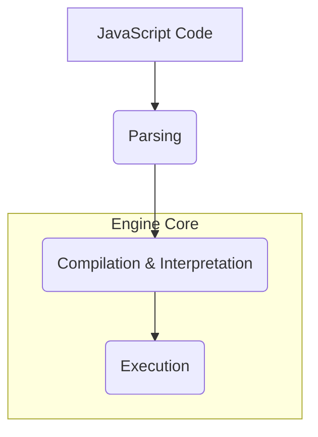
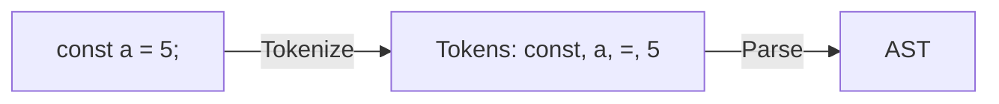
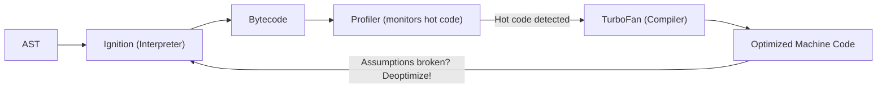
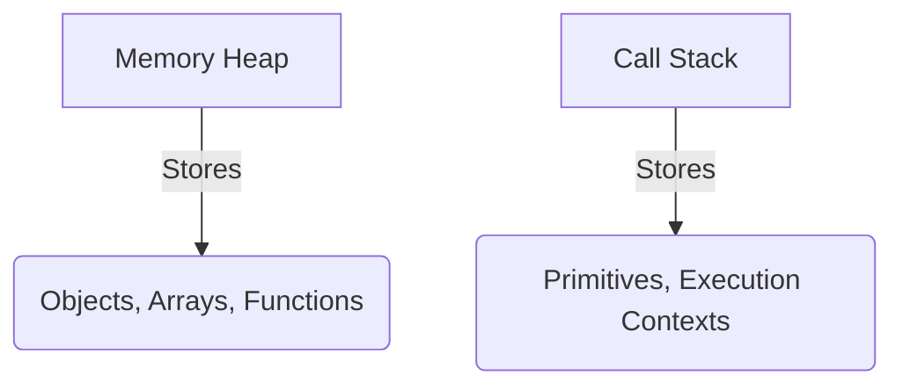

# ⚙️ JS Engine Architecture (V8)

A JavaScript engine is not a machine. It's a highly complex piece of software that takes your human-readable JavaScript code and translates it into machine code that the computer can actually execute.

## 🏗️ 1. Parsing Phase
Before doing anything, the engine reads your code and breaks it down step-by-step.

1. **JS Plain Code:** The raw text file containing your source code.
2. **Tokenization (Lexical Analysis):** Breaks the code into "tokens".
   - `let` -> Keyword
   - `x` -> Identifier
   - `=` -> Operator
   - `10` -> Number
   - `;` -> Punctuation
3. **Parsing:** Checks for grammar mistakes (Syntax Errors).
4. **AST (Abstract Syntax Tree):** Converts the parsed tokens into a tree structure that the engine can understand. For example, `x + y` becomes a tree where `+` is the root node, and `x` and `y` are the leaves.

## ⚡ 2. Compilation (JIT Compilation)
Historically, languages were either interpreted (fast to start, slow to run) or compiled (slow to start, fast to run). 
Modern JS engines (like V8) use **Just-In-Time (JIT) Compilation**, which combines the best of both!

1. The **Interpreter** (called Ignition in V8) quickly translates AST to unoptimized Bytecode so the program can start running immediately.
2. The **Profiler** watches the code as it runs, looking for "hot" areas (code that runs repeatedly, like loops).
3. The **Compiler** (called TurboFan in V8) takes those hot areas and compiles them down to highly optimized Machine Code.
4. If assumptions made during optimization turn out to be wrong (e.g., a variable type changes), TurboFan **deoptimizes** and sends the code back to Ignition!

## 🏃 3. Execution Phase
The optimized machine code is executed using two main memory structures:

- **Memory Heap:** A large unstructured region of memory used for storing objects and functions (reference types).
- **Call Stack:** Structured LIFO memory used for keeping track of the Execution Contexts and primitive variables.

## 🧹 Garbage Collection
JavaScript handles memory management automatically. It uses an algorithm called **Mark and Sweep**.
- It starts at the root (the global object).
- It "marks" all objects that are reachable/referenced.
- It "sweeps" (deletes) anything that is not marked, freeing up the memory in the Heap!
