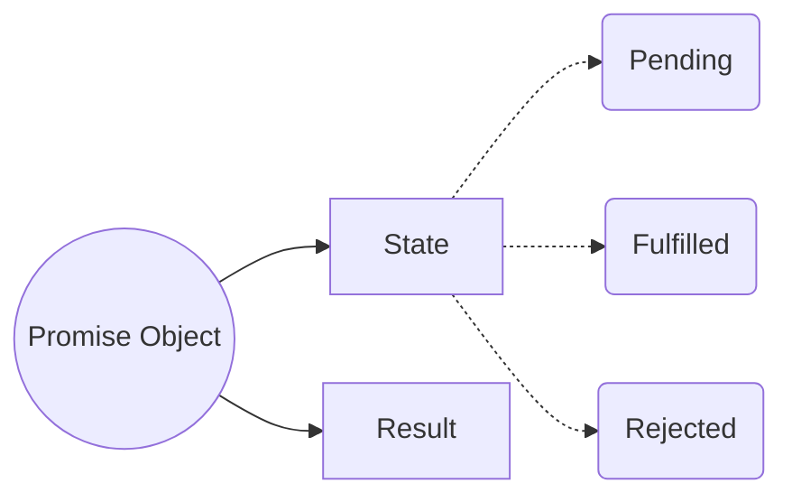
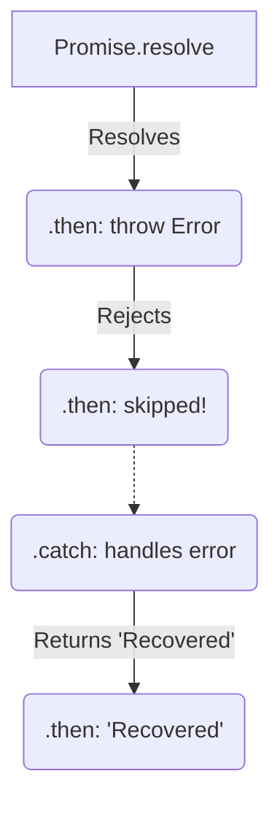

# 🤝 Promises & Chain Resolution

Before Promises, asynchronous code relied entirely on **callbacks**. Passing callbacks inside callbacks led to deeply nested, unreadable code known as **Callback Hell**, and suffered from **Inversion of Control** (giving up control of your callback to an external API).

Promises were introduced to solve this!



## 📦 1. What is a Promise?
A Promise is an object representing the eventual completion (or failure) of an asynchronous operation.
- It acts as a **placeholder** for data that we hope to get back in the future.
- Unlike callbacks where you pass the function *into* the API, with Promises, the API returns an empty object *to you*, and you attach your callback to it. (This fixes Inversion of Control!)

## 🚦 2. The 3 States of a Promise
1. `pending`: The initial state. The async task is still running.
2. `fulfilled`: The operation completed successfully.
3. `rejected`: The operation failed.

**Crucial Rule:** A Promise is immutable once it settles. It can only transition from `pending` -> `fulfilled` OR `pending` -> `rejected`. It can never change its state after that!

---

## 🔗 3. How `.then()` Chains Actually Resolve

To solve Callback Hell, Promises allow us to chain operations sequentially using `.then()`. But how does JavaScript know what to pass down the chain?

**The Golden Rule of `.then()`:** 
Every `.then()` and `.catch()` **always returns a brand new Promise**, even if you don't explicitly return one!

What happens inside the `.then()` determines the state of the *next* Promise in the chain:

### Scenario A: Returning a Primitive Value
If you return a primitive (string, number, object), the next Promise immediately resolves with that value.

```javascript
Promise.resolve(10)
    .then((num) => {
        return num * 2; // Returns a number (20)
    })
    .then((result) => {
        console.log(result); // 20
    });
```
*Under the hood:* Returning `20` is automatically wrapped into `Promise.resolve(20)`.

### Scenario B: Returning a Promise
If you return another Promise (like a `fetch` call), the outer Promise *adopts the state* of that returned Promise. It waits for it to finish!

```javascript
fetch("/api/user")
    .then((response) => {
        // response.json() returns a Promise!
        // The chain pauses here and waits for parsing to finish.
        return response.json(); 
    })
    .then((data) => {
        console.log(data); // The parsed JSON object
    });
```

### Scenario C: Not Returning Anything
If you don't return anything (or just `console.log`), the function implicitly returns `undefined`. The next `.then()` will receive `undefined`.

```javascript
Promise.resolve("Hello")
    .then((msg) => {
        console.log(msg); // Prints "Hello"
        // Forgot to return! Implicitly returns undefined
    })
    .then((nextMsg) => {
        console.log(nextMsg); // Prints "undefined"
    });
```

### Scenario D: Throwing an Error
If you `throw` an error inside a `.then()`, the returned Promise is immediately **rejected**. The chain skips all subsequent `.then()` blocks and falls straight down to the nearest `.catch()`.

```javascript
Promise.resolve("Start")
    .then(() => {
        throw new Error("Boom!"); // Instantly rejects the chain
    })
    .then(() => {
        console.log("This will never run!");
    })
    .catch((err) => {
        console.log("Caught:", err.message); // Prints: "Caught: Boom!"
        return "Recovered"; // .catch() ALSO returns a Promise!
    })
    .then((msg) => {
        console.log(msg); // Prints: "Recovered"
    });
```



---

## 🛠️ 4. Creating a Custom Promise

Sometimes you need to manually wrap old callback-based APIs (like `setTimeout`) into Promises.

```javascript
const myPromise = new Promise(function(resolve, reject) {
    // Simulating an async task (e.g., a network request)
    setTimeout(function() {
        const success = true;
        
        if (success) {
            resolve({ user: "Raj", id: 42 }); // ✅ Changes state to fulfilled
        } else {
            reject(new Error("Failed!"));     // ❌ Changes state to rejected
        }
    }, 2000);
});

// Consuming the promise
myPromise
    .then((result) => console.log("Got:", result))
    .catch((err) => console.error("Error:", err));
```


## 🎯 Common Interview Questions

**Q: What are the three states of a Promise?**
- **A:** `pending` (initial state, neither fulfilled nor rejected), `fulfilled` (operation completed successfully), and `rejected` (operation failed).