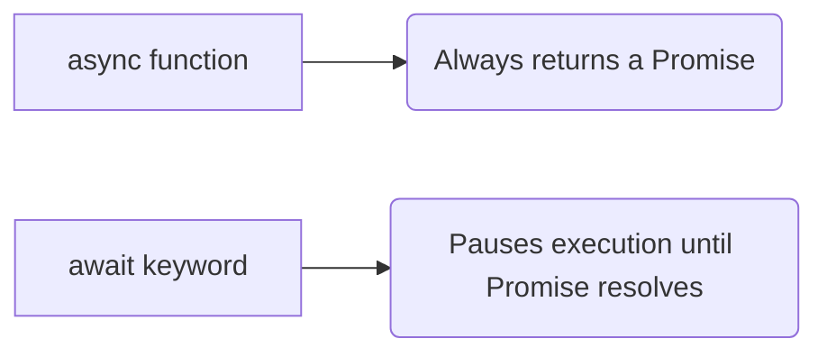
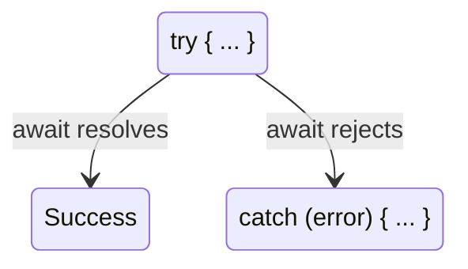
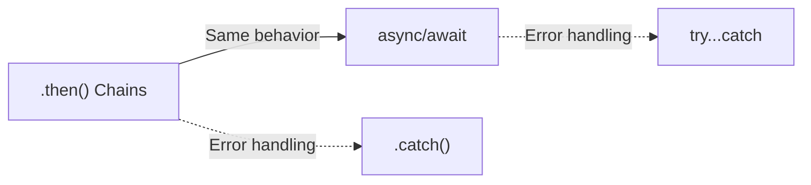

# ⏳ Async / Await

`async/await` is syntactic sugar built on top of Promises. It allows us to write asynchronous code that *looks* and *behaves* like synchronous code, making it incredibly easy to read!



## ✨ 1. The `async` keyword
When you place the word `async` before a function, two things happen:
1. It guarantees that the function will always return a Promise.
2. If you return a primitive value (like a string or number), JavaScript automatically wraps it inside a Promise!

## 🛑 2. The `await` keyword
`await` can **only** be used inside an `async` function.
It tells JavaScript to **pause execution** on that specific line until the Promise settles (resolves or rejects).

```javascript
async function handleData() {
    console.log("Starting...");
    
    // JS pauses here until fetch resolves!
    const response = await fetch("https://api.example.com/data"); 
    
    // JS pauses here until parsing is complete!
    const data = await response.json();
    
    console.log(data);
}
```

### 🧠 How `await` actually works under the hood
Does `await` actually freeze the entire JavaScript engine? **NO!** Remember, JS is single-threaded. If it froze, the browser would freeze.

When JS hits an `await` keyword:
1. It suspends the Execution Context of the `async` function.
2. It pops it off the Call Stack.
3. The rest of the program continues running normally.
4. Once the awaited Promise resolves in the background, the function's Execution Context is pushed *back* onto the Call Stack right where it left off!

## 🛡️ 3. Error Handling
Since `await` doesn't use `.catch()`, how do we handle errors? We use standard `try...catch` blocks!



```javascript
async function getData() {
    try {
        const response = await fetch("invalid-url");
        const data = await response.json();
    } catch (error) {
        console.error("Oops! Something went wrong:", error);
    }
}
```

---

## 🔄 4. Promise Chains vs Async/Await (Side-by-Side)

A very common interview question is: *"Rewrite this `.then()` chain using async/await."*

**Using `.then()` chains:**
```javascript
function fetchUserPosts() {
    fetch("/api/user")
        .then((res) => res.json())
        .then((user) => fetch(`/api/posts/${user.id}`))
        .then((res) => res.json())
        .then((posts) => console.log(posts))
        .catch((err) => console.error(err));
}
```

**Rewritten with `async/await`:**
```javascript
async function fetchUserPosts() {
    try {
        const userRes = await fetch("/api/user");
        const user = await userRes.json();
        const postsRes = await fetch(`/api/posts/${user.id}`);
        const posts = await postsRes.json();
        console.log(posts);
    } catch (err) {
        console.error(err);
    }
}
```



> **Key Insight:** `async/await` is just syntactic sugar over Promises. Under the hood, it still uses Promises. The only difference is readability — async/await reads top-to-bottom like synchronous code!


## 🎯 Common Interview Questions

**Q: How do you handle errors in `async/await` compared to `.then()` chains?**
- **A:** With `.then()`, you use the `.catch()` method at the end of the chain. With `async/await`, you wrap the `await` call inside a standard `try...catch` block.