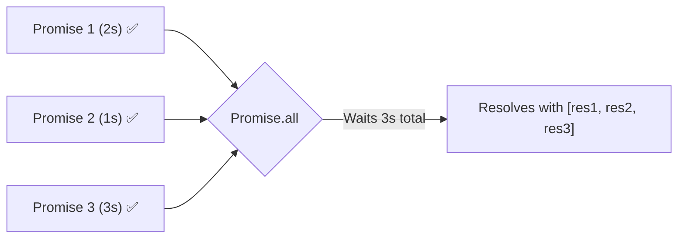
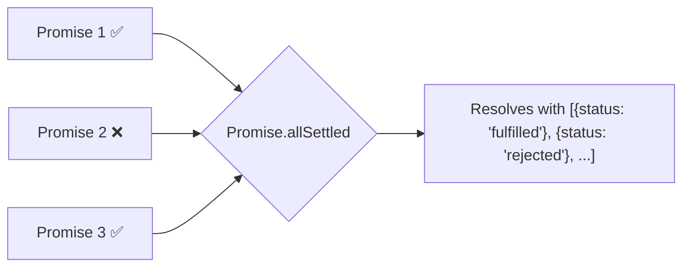
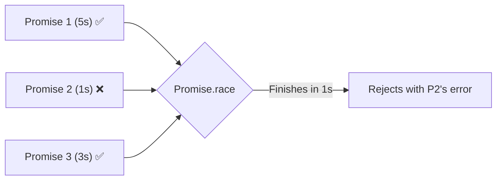
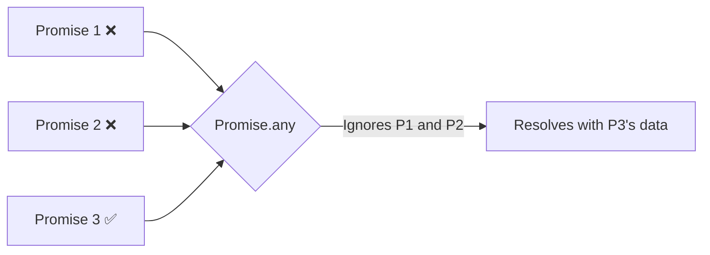

# 🚥 Advanced Promise APIs (Concurrency)

Often, you don't just want to await one Promise at a time. You might want to run 5 network requests simultaneously and wait for them all to finish, or maybe you only care about the one that finishes first.

JavaScript provides 4 powerful static methods on the `Promise` object to handle concurrency.

## 🤝 1. `Promise.all()` (All or Nothing)

`Promise.all` takes an array of Promises and executes them all concurrently. 
- It resolves **only if ALL promises resolve**. It returns an array of all the results.
- It rejects **instantly if ANY promise rejects**. (Short-circuits).



```javascript
const [users, posts] = await Promise.all([
    fetch('/api/users'),
    fetch('/api/posts')
]);
// This is much faster than awaiting them one by one!
```

---

## 🛡️ 2. `Promise.allSettled()` (The Safe Bet)

Introduced in ES2020, `Promise.allSettled` is like `Promise.all`, but **it never short-circuits**. It waits for all promises to finish (either resolve or reject) and returns an array of objects describing the outcome of each promise.



```javascript
const results = await Promise.allSettled([p1, p2, p3]);
// Use this when you need all tasks to finish, even if some fail!
```

---

## 🏎️ 3. `Promise.race()` (The Speed Demon)

`Promise.race` takes an array of promises and resolves/rejects as soon as the **very first promise finishes**. It ignores all the others.



> **Use Case:** Building a timeout for a fetch request! Race your `fetch()` against a 5-second `setTimeout` promise that rejects.

---

## 🥇 4. `Promise.any()` (The Optimist)

Introduced in ES2021, `Promise.any` is the opposite of `Promise.all`. It waits for the **first promise to fulfill (resolve)**. It completely ignores rejections, unless *all* of them reject (in which case it throws an `AggregateError`).



> **Use Case:** Querying 3 different servers for the same data to see which one replies successfully first!

---

## 🎯 Common Interview Questions

**Q: What is the difference between `Promise.all` and `Promise.allSettled`?**
- **A:** `Promise.all` short-circuits and rejects immediately if *any* single promise fails. `Promise.allSettled` always waits for all promises to finish, regardless of success or failure, and returns an array detailing the status of each.

**Q: How would you implement a timeout for a Promise?**
- **A:** By using `Promise.race`. You pass an array containing the target promise and a secondary promise that uses `setTimeout` to reject after a specific time limit. Whichever finishes first wins the race!
