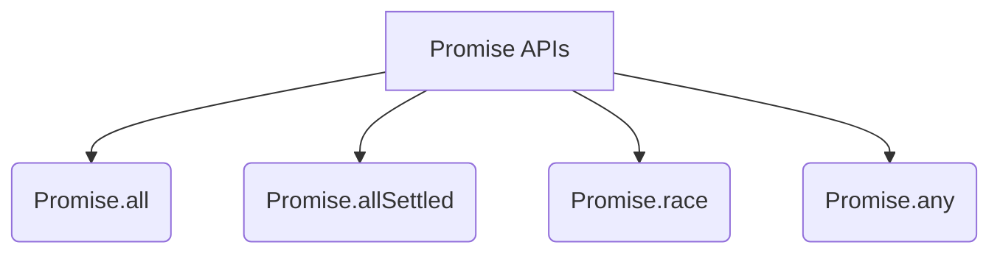
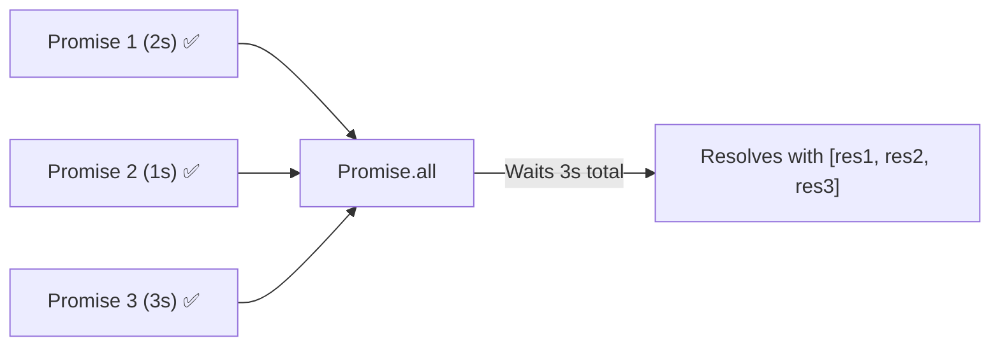

# 🚀 Promise APIs (Combinators)

When you need to handle multiple Promises at the same time, JavaScript provides four powerful Promise APIs (also known as Promise Combinators).



## 🏎️ 1. Promise.all()
`Promise.all([p1, p2, p3])` is used when you want all tasks to succeed. 
It waits for **ALL** promises to resolve. 



- **Success:** Returns an array of all results `[val1, val2, val3]`. Time taken is equal to the longest promise.
- **Failure:** **"All or Nothing!"** If *even one* promise rejects, the entire `Promise.all` immediately throws an error and cancels out, regardless of the others.

## 🛡️ 2. Promise.allSettled()
`Promise.allSettled([p1, p2, p3])` is the safer version of `Promise.all`.
It waits for **ALL** promises to settle (meaning it waits for them to either resolve OR reject).

- **Result:** It always returns an array of objects detailing the outcome of each promise. It never completely fails just because one promise rejected.

```javascript
[
  {status: "fulfilled", value: "Success data"},
  {status: "rejected", reason: "Error message"}
]
```

## 🏁 3. Promise.race()
`Promise.race([p1, p2, p3])` is exactly what it sounds like: a race.
It returns the result of the **FIRST** promise that settles (whether it resolves or rejects).

- **Success:** First person to cross the finish line wins! (Returns the value).
- **Failure:** If the first person to cross the finish line crashes (rejects), the whole race returns an error immediately.

## 🥇 4. Promise.any()
`Promise.any([p1, p2, p3])` is a race for the **FIRST SUCCESS**.
It waits for the first promise to *resolve* (ignoring any rejections along the way).

- **Success:** Returns the value of the first successful promise.
- **Failure:** What if they ALL reject? It returns an AggregateError: `"All promises were rejected"`.

---

## 📊 Quick Reference Cheat Sheet

| API | What it waits for | When it Resolves | When it Rejects |
| :--- | :--- | :--- | :--- |
| **`Promise.all`** | All to resolve | Array of all results | First rejection (Short-circuits) |
| **`Promise.allSettled`** | All to settle | Array of all outcomes | Never (Always resolves) |
| **`Promise.race`** | First to settle | Value of first settled | Error of first settled |
| **`Promise.any`** | First to resolve | Value of first resolved | Only if ALL reject (AggregateError) |

---

## 🎯 Common Interview Questions

**Q: Which Promise API would you use to fetch data from 3 different APIs where you want all data, but if one fails you want to show an error message?**
- **A:** `Promise.all()`. It has "fail-fast" behavior, meaning it will reject immediately if any of the requests fail.

**Q: Which API would you use if you are fetching the exact same data from 3 different mirrored servers to see which one replies fastest?**
- **A:** `Promise.any()`. You want the first successful response. If you used `Promise.race()`, and the fastest server returned a 500 error, your entire request would fail even if the slower servers succeeded!