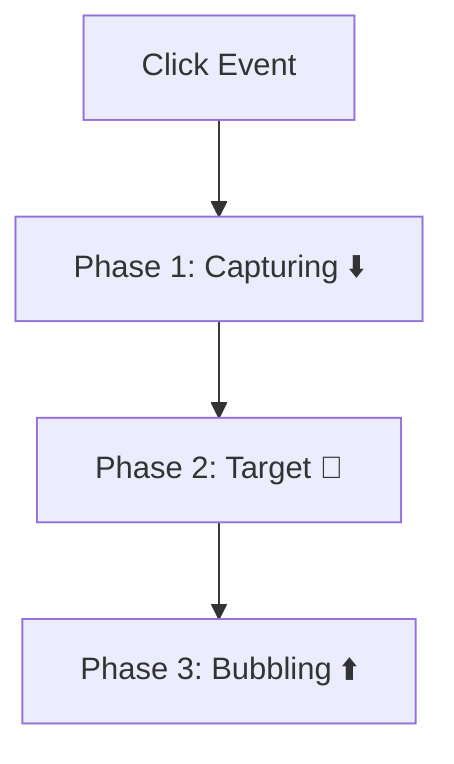
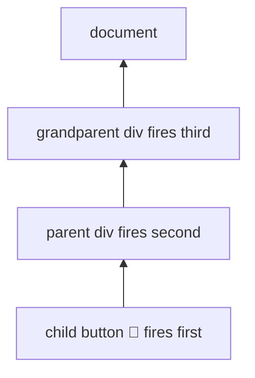
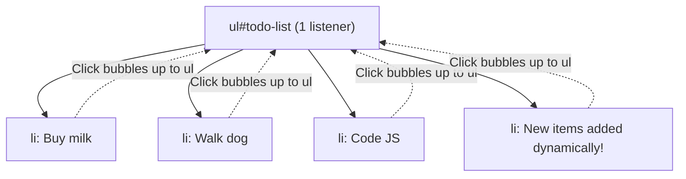

# 🫧 Event Delegation, Bubbling & Capturing

> ⚠️ **Note:** This section covers **browser-specific** JavaScript. If you only work with Node.js, feel free to skip this entire section!

When you click a button inside a `<div>` inside a `<body>`, which element's event handler fires first? Understanding **event propagation** is critical for building efficient web applications.



---

## ⬆️ 1. Event Bubbling (Default Behavior)

When an event occurs on an element, it first runs its own handler, then runs the handler on its parent, then its parent's parent, and so on — all the way up to the `document`. It **bubbles up** like a bubble in water!

```javascript
// HTML: <div id="grandparent"><div id="parent"><button id="child">Click</button></div></div>

document.getElementById("grandparent").addEventListener("click", () => {
    console.log("Grandparent clicked!");
});
document.getElementById("parent").addEventListener("click", () => {
    console.log("Parent clicked!");
});
document.getElementById("child").addEventListener("click", () => {
    console.log("Child clicked!");
});

// Clicking the button outputs:
// "Child clicked!"       ← Target
// "Parent clicked!"      ← Bubbles up
// "Grandparent clicked!" ← Bubbles up
```



---

## ⬇️ 2. Event Capturing (Trickling)

Capturing is the opposite of bubbling — the event starts from the **top** (document) and trickles **down** to the target. You enable it by passing `{ capture: true }` as the third argument.

```javascript
document.getElementById("grandparent").addEventListener("click", () => {
    console.log("Grandparent!");
}, { capture: true }); // Enable capturing!

document.getElementById("child").addEventListener("click", () => {
    console.log("Child!");
});

// Clicking the button outputs:
// "Grandparent!" ← Captures first (top-down)
// "Child!"       ← Then target fires
```

---

## 🛑 3. Stopping Propagation

You can stop the event from traveling further using `event.stopPropagation()`:

```javascript
document.getElementById("child").addEventListener("click", (e) => {
    console.log("Child clicked!");
    e.stopPropagation(); // Stop! Don't bubble up to parent!
});
```

---

## 🎯 4. Event Delegation (The Power Pattern)

Instead of attaching event listeners to **every single child** element, you attach a **single listener** to the parent and use the event's `target` property to figure out which child was clicked.

### The Problem (Inefficient):
```javascript
// ❌ Attaching listener to every single item — wasteful!
document.querySelectorAll("li").forEach((item) => {
    item.addEventListener("click", (e) => {
        console.log("Clicked:", e.target.textContent);
    });
});
```

### The Solution (Event Delegation):
```javascript
// ✅ Single listener on the parent — efficient!
document.getElementById("todo-list").addEventListener("click", (e) => {
    if (e.target.tagName === "LI") {
        console.log("Clicked:", e.target.textContent);
    }
});
```



### Why Event Delegation is Amazing:
1. **Performance** — 1 listener instead of 100.
2. **Dynamic elements** — Works for elements added later (via JavaScript), since the listener is on the parent which already exists!
3. **Less memory** — Fewer event handlers = less memory usage.

---

## 🔑 Key Takeaways
1. Events propagate in 3 phases: Capture → Target → Bubble.
2. **Bubbling** is the default (bottom to top).
3. **Capturing** is opt-in with `{ capture: true }` (top to bottom).
4. **Event Delegation** uses bubbling to handle events efficiently with a single parent listener.
5. Use `e.stopPropagation()` to stop the event from traveling further.


> **💡 Skip Note for Node.js:** This section covers Browser APIs. If you are learning JavaScript strictly for Node.js backend development, you can skip this file as these APIs do not exist in Node.


## 🎯 Common Interview Questions

**Q: What is Event Delegation and what is its main benefit?**
- **A:** Event delegation is attaching a single event listener to a parent element to manage events for all its children (using event bubbling). The main benefit is better performance (fewer listeners in memory) and the ability to handle dynamically added child elements without binding new listeners.