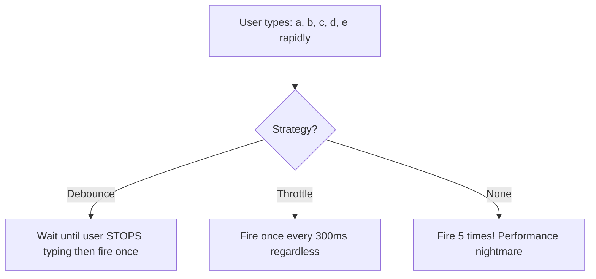

# ⏱️ Debounce & Throttle

> [!TIP]
> **The 30-Second Interview Pitch**
> Debounce and Throttle are optimization techniques used to limit the rate at which a function is executed. **Debouncing** delays the execution of a function until a certain amount of time has passed *since the last time* it was invoked (e.g., waiting for a user to stop typing before fetching search results). **Throttling** ensures that a function is executed at most once in a specified time interval, regardless of how many times the event fires (e.g., limiting scroll or resize event handlers).

Debounce and Throttle are essential for optimizing performance when dealing with events that fire rapidly (scrolling, resizing, typing).



---

## 🔕 1. Debounce

Debounce ensures a function is only called **after the user has STOPPED performing an action** for a specified delay period. If the action is repeated before the delay ends, the timer resets.

### Use cases:
- Search bar auto-suggestions (wait until user stops typing)
- Window resize handlers

### Implementation:

```javascript
function debounce(fn, delay) {
    let timer;
    return function(...args) {
        clearTimeout(timer); // Reset the timer!
        timer = setTimeout(() => {
            fn.apply(this, args);
        }, delay);
    };
}

// Usage:
const search = debounce(function(query) {
    console.log("Searching for:", query);
}, 300);

inputElement.addEventListener("input", (e) => search(e.target.value));
```

---

## 🚦 2. Throttle

Throttle ensures a function is called **at most once** within a specified time window. Unlike debounce, it guarantees the function fires at regular intervals.

### Use cases:
- Scroll event handlers (infinite scroll, analytics)
- Button click protection (prevent double-submit)

### Implementation:

```javascript
function throttle(fn, limit) {
    let inThrottle = false;
    return function(...args) {
        if (!inThrottle) {
            fn.apply(this, args);
            inThrottle = true;
            setTimeout(() => {
                inThrottle = false;
            }, limit);
        }
    };
}
```

### ⚛️ Real-World Example: React Hooks (Throttling a Scroll Event)
When using these patterns in React, you typically wrap the logic in a `useEffect` hook and ensure you cleanup the event listener to avoid memory leaks.

```jsx
import React, { useEffect } from "react";

function ScrollTracker() {
  useEffect(() => {
    const handleScroll = () => {
      console.log("Scroll event triggered at:", window.scrollY);
    };

    // Throttle the scroll handler to run at most once per second
    const throttledScroll = throttle(handleScroll, 1000);

    // Attach event listener
    window.addEventListener("scroll", throttledScroll);

    // Cleanup phase: Remove listener on unmount
    return () => window.removeEventListener("scroll", throttledScroll);
  }, []);

  return <div style={{ height: "200vh" }}>Scroll Down!</div>;
}
```

---

## 🆚 3. Debounce vs Throttle — Side by Side

| Feature | Debounce | Throttle |
|:---|:---|:---|
| **When it fires** | After user **stops** for X ms | Every X ms **at most** |
| **Guarantees execution?** | Only the last call | At regular intervals |
| **Best for** | Search input, window resize | Scroll tracking, button spam |
| **If user keeps acting** | Never fires (timer keeps resetting) | Fires at fixed intervals |

> [!WARNING]
> **Gotcha: Both rely on Closures!**
> Under the hood, both Debounce and Throttle work because of **Closures**. The inner returned function "remembers" the `timer` or `inThrottle` variables from its lexical scope, allowing the state to persist across multiple rapid event triggers.