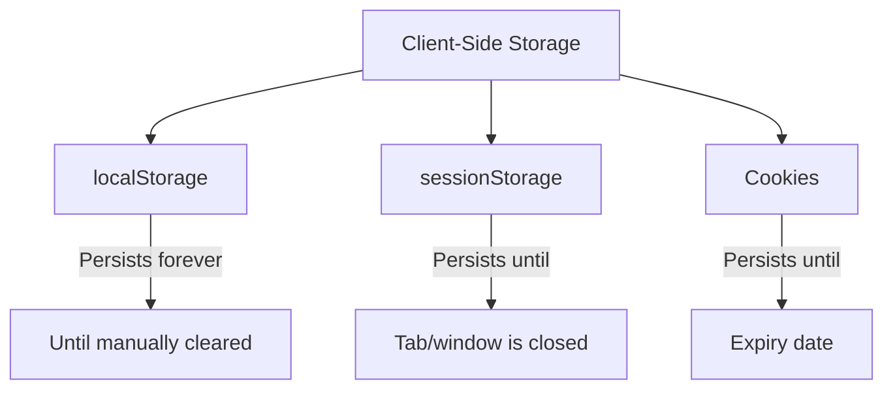

# 🗄️ Storage: localStorage, sessionStorage & Cookies

> ⚠️ **Note:** This section is **browser-specific**. These APIs do not exist in Node.js.

The browser provides multiple ways to store data on the client side. Understanding the differences between them is a common interview question.



---

## 📦 1. `localStorage`

Data stored in `localStorage` **persists forever** — even after the browser is closed and reopened. It is only cleared when the user (or your code) explicitly removes it.

```javascript
// Store data
localStorage.setItem("theme", "dark");
localStorage.setItem("user", JSON.stringify({ name: "Raj", age: 25 }));

// Retrieve data
const theme = localStorage.getItem("theme"); // "dark"
const user = JSON.parse(localStorage.getItem("user")); // { name: "Raj", age: 25 }

// Remove a specific item
localStorage.removeItem("theme");

// Clear ALL localStorage data
localStorage.clear();
```

### Key Properties:
- **Capacity:** ~5-10 MB (varies by browser)
- **Scope:** Same origin (protocol + domain + port)
- **Access:** Client-side only (JavaScript)
- **Sent with requests?** ❌ No

---

## 📋 2. `sessionStorage`

`sessionStorage` works exactly like `localStorage`, except the data is cleared when the **tab or window is closed**.

```javascript
// Same API as localStorage
sessionStorage.setItem("formData", JSON.stringify({ step: 2 }));
const data = JSON.parse(sessionStorage.getItem("formData"));
sessionStorage.removeItem("formData");
```

### Key Properties:
- **Capacity:** ~5-10 MB
- **Scope:** Same origin AND same tab (opening a new tab = new session)
- **Access:** Client-side only
- **Sent with requests?** ❌ No

---

## 🍪 3. Cookies

Cookies are the oldest storage mechanism. They are primarily used for **authentication** and **tracking** because they are **automatically sent with every HTTP request** to the server.

```javascript
// Set a cookie (expires in 7 days)
document.cookie = "username=Raj; expires=" + new Date(Date.now() + 7 * 24 * 60 * 60 * 1000).toUTCString() + "; path=/";

// Set a secure cookie
document.cookie = "token=abc123; Secure; HttpOnly; SameSite=Strict";

// Read all cookies (returns a single string!)
console.log(document.cookie); // "username=Raj; token=abc123"
```

### Key Properties:
- **Capacity:** ~4 KB per cookie (very small!)
- **Scope:** Same origin, configurable via `path` and `domain`
- **Access:** Both client-side and server-side
- **Sent with requests?** ✅ Yes — automatically sent with every HTTP request!

### Important Cookie Flags:
| Flag | Purpose |
|:---|:---|
| `Secure` | Cookie only sent over HTTPS |
| `HttpOnly` | Cannot be accessed via JavaScript (protects against XSS) |
| `SameSite` | Controls cross-site request behavior (CSRF protection) |
| `Max-Age` / `Expires` | How long the cookie lives |

---

## 📊 Comparison Table

| Feature | `localStorage` | `sessionStorage` | Cookies |
|:---|:---|:---|:---|
| **Capacity** | ~5-10 MB | ~5-10 MB | ~4 KB |
| **Lifetime** | Forever (until cleared) | Until tab closes | Until expiry date |
| **Sent to server?** | ❌ No | ❌ No | ✅ Yes (every request!) |
| **Access** | Client only | Client only | Client + Server |
| **Scope** | Same origin | Same origin + same tab | Configurable |
| **Best for** | User preferences, caching | Temporary form data | Auth tokens, sessions |

---

## 🔑 Key Takeaways
1. Use **`localStorage`** for persistent client-side data (themes, settings).
2. Use **`sessionStorage`** for temporary data that should die with the tab.
3. Use **Cookies** when you need to send data to the server (authentication).
4. **Never store sensitive data** (passwords, credit cards) in `localStorage` or `sessionStorage` — they are accessible via JavaScript and vulnerable to XSS attacks!


> **💡 Skip Note for Node.js:** This section covers Browser APIs. If you are learning JavaScript strictly for Node.js backend development, you can skip this file as these APIs do not exist in Node.


## 🎯 Common Interview Questions

**Q: What is the main security difference between LocalStorage and HttpOnly Cookies?**
- **A:** LocalStorage is fully accessible via JavaScript, making it vulnerable to XSS (Cross-Site Scripting) attacks. HttpOnly cookies cannot be accessed by JavaScript, making them much safer for storing sensitive tokens like JWTs.