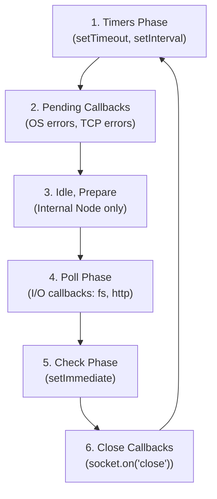

# The Event Loop Deep Dive

> [!TIP]
> **The 30-Second Interview Pitch**
> *"The Event Loop is a C program running inside `libuv` that continuously iterates through 6 distinct phases to execute callbacks. It ensures non-blocking I/O by offloading tasks to the OS or Thread Pool, and polling for their completion. The most critical phases are the **Timers phase** (for `setTimeout`), the **Poll phase** (where almost all I/O callbacks like file reads or HTTP requests run), and the **Check phase** (specifically for `setImmediate`)."*

If there is only one concept you learn in Node.js, make it the Event Loop. If you cannot explain the phases, you will not pass a senior interview.

## The 6 Phases of the Event Loop

When you run `node index.js`, Node executes the synchronous code from top to bottom. Then, it enters the Event Loop. The loop continues spinning as long as there are pending asynchronous operations or active servers.

The Event Loop is not a single queue; it is a series of **6 distinct phases**. Each phase has its own queue of callbacks.



### 1. Timers Phase
This is the beginning of the loop. 
- **What runs here:** Callbacks scheduled by `setTimeout()` and `setInterval()`.
- **Note:** A timer specifies the *threshold* after which a callback *may* be executed, not the exact time. If the Poll phase is busy, your 100ms timer might take 150ms to execute.

### 2. Pending Callbacks Phase
- **What runs here:** System-level callbacks. For example, if a TCP socket throws an `ECONNREFUSED` error, the OS reports it here.

### 3. Idle, Prepare Phase
- Internal use only by `libuv`. You don't need to know this for interviews.

### 4. Poll Phase (The Most Important Phase)
This is where the vast majority of your application's work happens.
- **What runs here:** Almost all I/O callbacks (e.g., `fs.readFile`, `http.get`, database queries).
- **The Magic:** If the Poll queue is empty, but there are no timers waiting to fire, **the Event Loop will pause and wait in this phase** for new I/O events to arrive! This is why a Node.js server stays alive instead of exiting immediately.

### 5. Check Phase
- **What runs here:** Callbacks scheduled exclusively by `setImmediate()`.
- **Why it exists:** It allows you to execute code *immediately after* the Poll phase completes. 

### 6. Close Callbacks Phase
- **What runs here:** Cleanup callbacks like `socket.destroy()` or `server.on('close')`.

---

## 🚨 The Ultimate Interview Question

Look at this code. What order does it print in?

```javascript
const fs = require('fs');

setTimeout(() => console.log('1. Timer'), 0);
setImmediate(() => console.log('2. Immediate'));

fs.readFile(__filename, () => {
  setTimeout(() => console.log('3. Timer inside I/O'), 0);
  setImmediate(() => console.log('4. Immediate inside I/O'));
});
```

**The Output:**
```
1. Timer        (Usually)
2. Immediate    (Usually)
4. Immediate inside I/O
3. Timer inside I/O
```

**The Explanation (How to ace the interview):**
1. When running at the top level, `setTimeout(0)` and `setImmediate` are at the mercy of process performance. The order is non-deterministic depending on if the machine is fast enough to put the timer in the queue before the loop starts.
2. **HOWEVER**, inside an I/O callback (`fs.readFile`), the order is **100% deterministic**.
3. Why? `fs.readFile` finishes in the **Poll Phase**. 
4. The Poll phase executes the callback. Inside the callback, we queue a Timer (Phase 1) and an Immediate (Phase 5).
5. When the Poll phase finishes, the loop moves to the next phase: the **Check Phase**.
6. Therefore, `setImmediate` (4) is ALWAYS guaranteed to run before `setTimeout` (3) when they are queued inside an I/O callback!
