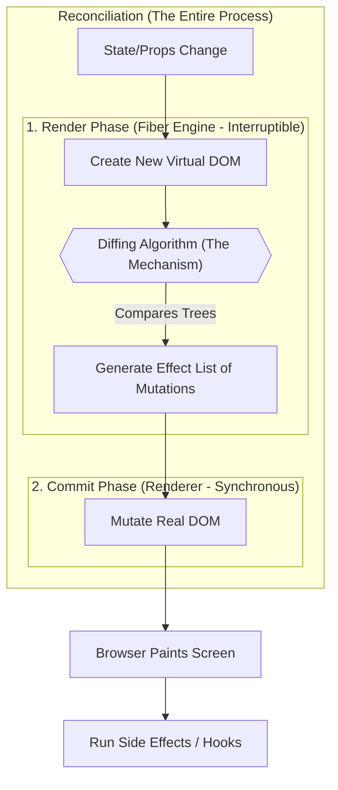

# React Fiber Architecture

> [!TIP]
> **The 30-Second Interview Pitch**
> *"React Fiber is the core reconciliation engine introduced in React 16. Its primary goal is to enable incremental rendering. Unlike the old synchronous Stack Reconciler that could block the main thread and drop frames, Fiber breaks rendering work into interruptible chunks. This allows React to pause rendering, prioritize high-priority updates (like user typing) over low-priority ones (like data fetching), and ensure the UI remains consistently smooth and responsive."*

Introduced in React 16, React Fiber is a complete, backward-compatible rewrite of the React core reconciliation algorithm. It serves as the engine that powers modern React applications.

## The Architecture Prior to Fiber (React 15 and earlier)

Before the introduction of Fiber, React utilized a "Stack Reconciler" which operated synchronously.

When a state change occurred, React would begin at the top of the component tree and recursively process every component down to the bottom. This process could not be interrupted.

If the component tree was deep and complex, this synchronous traversal would occupy the main thread completely. Consequently, the browser was unable to paint the screen, process user input, or execute animations until React had finished its rendering cycle. This often resulted in unresponsive user interfaces and dropped frames when handling substantial updates.

## The React Fiber Concept

React Fiber is the modern reconciliation engine designed primarily to enable incremental rendering of the virtual DOM.

Fiber does not introduce a new Diffing Algorithm. The core principles of the Diffing Algorithm, such as evaluating element types and keys, remain unchanged. Instead, Fiber represents a new underlying engine that executes the algorithm. While the previous engine executed the diffing process synchronously, Fiber provides an architecture to process work in chunks, allowing rendering to be paused, prioritized, and resumed.

A "Fiber" is essentially a JavaScript object that represents a distinct unit of work.

By breaking the rendering workload into these smaller units, React gains the ability to:
1. Pause work and return to it later.
2. Assign priority to different types of work.
3. Reuse previously completed work.
4. Abort work if it is no longer necessary.

## Scheduling and Priorities

Fiber introduces a scheduling system, allowing React to manage tasks on a single thread much like an operating system.

Upon an update, React creates tasks represented by Fibers and assigns them priorities based on their origin.

*   **High Priority (Synchronous):** User interactions such as typing, clicking, or hovering. These actions require immediate feedback to ensure the interface feels responsive.
*   **Low Priority (Asynchronous):** Background operations like data fetching, large list rendering, or off-screen updates. These can be delayed slightly without impacting the user experience.

## The Render and Commit Phases

Fiber divides the React rendering process into two distinct phases:

### 1. The Render Phase (Asynchronous and Interruptible)

During this phase, React traverses the component tree to determine what changes are required in the DOM.
*   It constructs a "Work-in-progress" Fiber tree alongside the current tree.
*   Crucially, this phase can be paused, aborted, or restarted.
*   If a high-priority task arrives while React is processing a low-priority task, React will pause the lower-priority work, address the high-priority input, and subsequently resume the initial task.
*   Because this phase can execute multiple times and be interrupted, lifecycle functions used within it must be pure and free of side-effects.

### 2. The Commit Phase (Synchronous and Uninterruptible)

Once the Render phase concludes and React has identified the necessary changes, it transitions to the Commit phase.
*   In this phase, the calculated changes (the "effect list") are applied.
*   React Fiber, functioning as the reconciler, does not directly interact with the Real DOM or paint the screen. That responsibility belongs to the Renderer, such as `react-dom` for web environments. Fiber calculates the diff, and the renderer applies that diff to the actual interface.
*   This phase is synchronous and cannot be interrupted.
*   After the DOM is updated, React executes side effects, such as those defined in `useEffect` and `useLayoutEffect`.

## The Fiber Data Structure

At its core, a Fiber node is a plain JavaScript object. Unlike the older stack reconciler, which relied on the call stack to traverse the tree, Fiber utilizes a singly linked list data structure to represent the component tree.

Each Fiber node maintains pointers to its relatives:
*   **`child`:** The first child component.
*   **`sibling`:** The next sibling component.
*   **`return`:** The parent component.

This linked list structure permits React to traverse the tree using a loop rather than recursion, which is what makes pausing and resuming the traversal possible.

## End-to-End Update Lifecycle (Reconciliation vs. Diffing)

To understand the lifecycle, it is critical to distinguish between **Reconciliation** and **Diffing**:

*   **Reconciliation** is the *entire overarching process* of figuring out what changed and applying those changes to the screen. It encompasses everything from the moment state changes to the moment the DOM is updated.
*   **Diffing** is just one *specific step* inside the reconciliation process. It is the algorithm used to compare two Virtual DOM trees to find the differences.

Here is a visualization of how they fit together:

The sequence of events proceeds as follows:

1.  **State Change (Start of Reconciliation):** An event handler or similar mechanism initiates a state update.
2.  **Render Phase (Fiber Engine):** 
    *   React constructs a new Virtual DOM tree representing the UI for the updated state.
    *   The **Diffing Algorithm** is executed to compare this new VDOM tree with the previous one.
    *   React determines the exact differences and generates an Effect List of the necessary mutations.
    *   This phase occurs entirely in memory, is interruptible, and does not affect the visible screen.
3.  **Commit Phase (Renderer - End of Reconciliation):** 
    *   React passes the Effect List to the Renderer.
    *   The Renderer synchronously mutates the Real DOM based on the Effect List, adding, updating, or removing nodes as needed.
4.  **Browser Paint:**
    *   With the Real DOM updated, the browser recalculates the CSS layout and repaints the screen, making the changes visible to the user.
5.  **Side Effects:**
    *   Finally, React executes any hooks or side effects that were dependent on the completed render.

## Conclusion

React Fiber transformed React from a synchronous, blocking system into an asynchronous, interruptible engine. By dividing the rendering process into smaller, prioritized units of work, Fiber ensures that the main thread remains free to handle crucial interactions. This architecture results in smoother animations and highly responsive interfaces, even within deeply complex applications.
