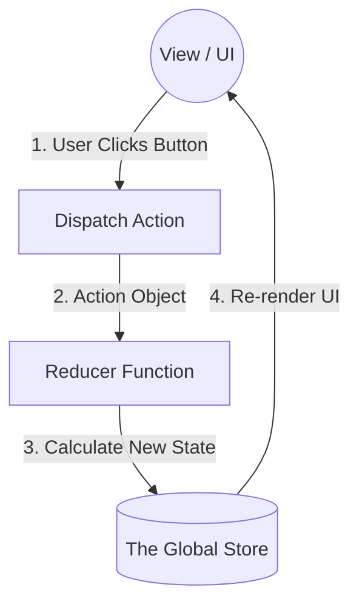

# Why Redux? (The Flux Architecture)

> [!TIP]
> **The 30-Second Interview Pitch**
> *"Redux is a predictable, global state container based on the Flux architecture. While Context API is great for simple dependency injection, it lacks granular subscriptions and forces all consumers to re-render when any value changes. Redux solves this by maintaining a single, immutable Store outside the React tree. Components only dispatch Actions, Reducers calculate the new state, and components subscribe only to the specific slices of data they need, ensuring maximum performance for complex, high-frequency updates."*

If React has a built-in Context API, why does almost every large enterprise application use Redux? 

As we learned in the Context module, the Context API is great for Dependency Injection (teleporting data), but it is **terrible** for high-frequency Global State Management. When a Context value changes, it indiscriminately forces a re-render of every component consuming it.

Redux solves this by pulling the state **completely out** of the React component tree.

## The Problems Redux Solves

1. **Performance (Granular Subscriptions):** In Redux, components can subscribe to *specific slices* of the global state. If a user adds an item to the shopping cart, only the `<CartIcon />` re-renders. The `<UserProfile />` ignores the update entirely, even though they share the same global store.
2. **Predictability:** In native React, state can be updated from anywhere using `setState`. In a massive app, tracking down *who* changed the state is a nightmare. Redux enforces strict rules on how state can be changed.
3. **Debugging (Redux DevTools):** Redux provides powerful browser extensions allowing you to "time travel" through state changes, inspecting exactly what happened at every step.

---

## Under the Hood: The Flux Architecture

Redux is based on Facebook's **Flux Architecture**. To understand Redux, you must understand the unidirectional flow of Flux.

It relies on three core concepts: **The Store**, **Actions**, and **Reducers**.

### 1. The Store (The Single Source of Truth)
Instead of having state scattered across dozens of parent components, Redux moves all global state into a single, massive JavaScript object called the **Store**. This store sits *outside* your React component tree.

### 2. Actions (The "What Happened" Events)
Components **cannot** directly modify the Store. If a component wants to change data, it must emit an **Action**. An Action is just a plain JavaScript object describing an event.

```javascript
// An Action Object
{
  type: 'cart/itemAdded',
  payload: { id: 123, name: 'Laptop' }
}
```
Think of an action as a formal request to the bank teller. You don't jump the counter and grab the money; you hand the teller a deposit slip (the Action).

### 3. Reducers (The "How It Changes" Logic)
When an Action is emitted (or "Dispatched"), it is sent to a **Reducer**. 
A Reducer is a pure function that takes the *current state* and the *action*, and calculates the *new state*.

```javascript
// A conceptual Reducer function
function cartReducer(state = [], action) {
  if (action.type === 'cart/itemAdded') {
    // Return a completely NEW state array (Immutability is required!)
    return [...state, action.payload];
  }
  return state;
}
```

## The Unidirectional Data Flow

This creates a strict, one-way loop that makes your application incredibly predictable:

1. **View:** The UI displays data from the Store.
2. **Dispatch:** The user clicks a button, and the View **Dispatches** an Action.
3. **Reducer:** The Store passes the Action to the Reducer, which calculates the new state.
4. **Update:** The Store updates, and automatically notifies the View to re-render with the new data.



> [!NOTE]
> **Legacy Redux vs Redux Toolkit (RTK)**
> Historically, writing Redux code involved massive amounts of "boilerplate" (manually writing out switch statements, action creators, and immutable spread operators). 
> 
> Today, the React team strongly recommends **Redux Toolkit (RTK)**, which abstracts away all the tedious boilerplate and makes Redux an absolute joy to use. We will focus entirely on RTK in the next sections.
